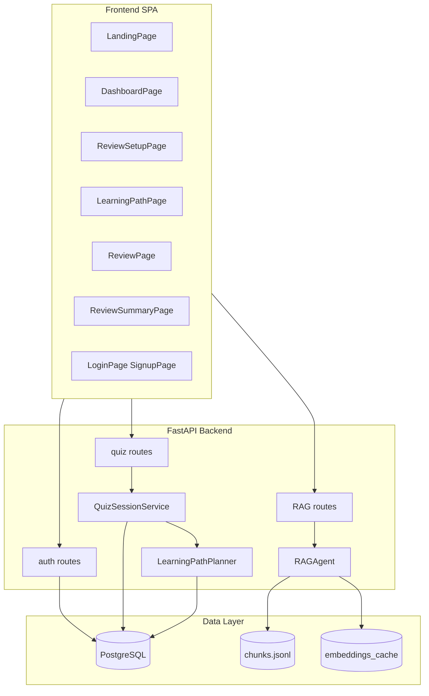
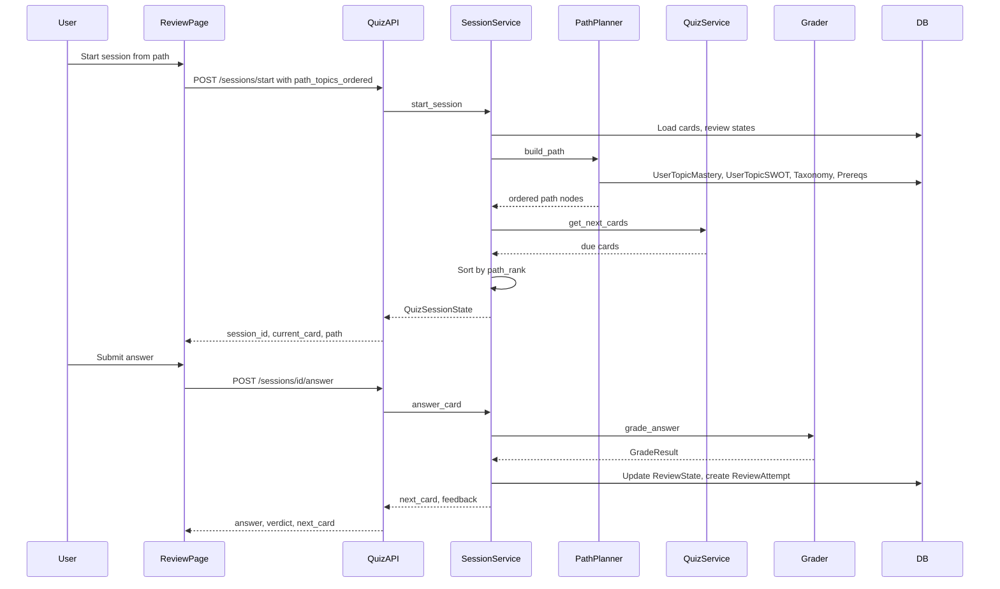
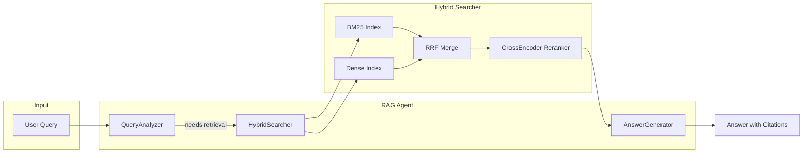
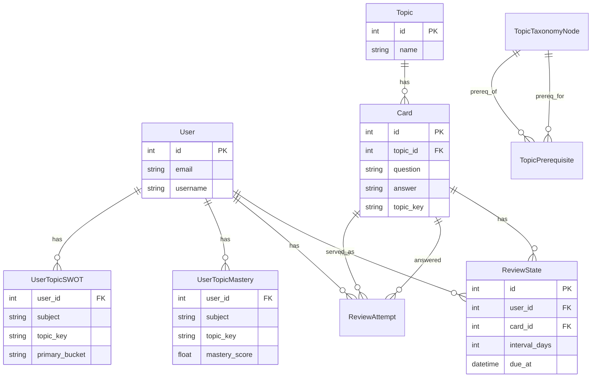
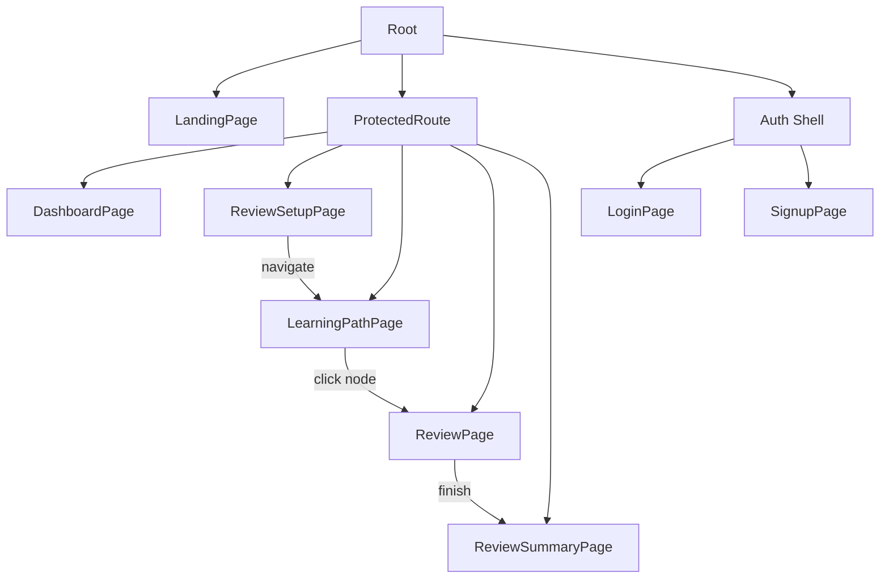
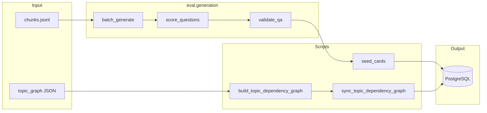

# Architecture

This document describes the CoreCS Interview Lab architecture: how the frontend, API, database, RAG pipeline, and quiz system fit together.

## Overview

The app has three main subsystems:

1. **RAG API** — Hybrid retrieval (BM25 + dense embeddings) with citation-backed chat and search
2. **Quiz system** — Spaced repetition sessions, LLM grading, learning path ordering
3. **Offline pipeline** — Generate questions from chunks, score and validate, seed into the database

All of this sits behind a FastAPI backend and a React SPA frontend.

## System Architecture

## Quiz Session Flow

When a user starts a review session, the frontend sends topics (and optionally an ordered list of topic keys from the learning path). The backend loads cards, fetches review states, builds a path order, sorts cards by that order, and serves them one at a time. Each answer is graded by the LLM and the scheduler updates the review state.

## RAG Pipeline

The RAG system uses hybrid retrieval: BM25 for lexical search, dense embeddings for semantic search, and RRF (Reciprocal Rank Fusion) to merge results. Optional components include a cross-encoder reranker, query rewriting, and HYDE (hypothetical document embeddings). The orchestrator agent decides whether retrieval is needed and runs single-hop or multi-hop retrieval before generating the answer.

## Data Model

Core entities for the quiz system: users, topics, cards, review states, and review attempts. The learning path depends on taxonomy, prerequisites, per-user mastery, and per-user SWOT scores.

## Frontend Routes

The app uses React Router with nested routes. Protected routes (dashboard, review flow) require authentication. The review flow is: setup (pick topics/limit) -> learning path (optional, shows node graph) -> review (answer questions) -> summary.

## Offline QA Pipeline

Cards are not written by hand. The pipeline generates candidate questions from chunks, scores them with an LLM, validates format and quality, and seeds the database. The topic dependency graph (taxonomy and prerequisites) is built and synced separately.

## Key Directories

| Path                | Purpose                                             |
| ------------------- | --------------------------------------------------- |
| `src/api/`          | FastAPI app, routes, CORS, lifespan                 |
| `src/auth/`         | JWT auth, signup, login, session                    |
| `src/db/`           | SQLAlchemy models, async session                    |
| `src/rag/`          | BM25, dense index, hybrid search, reranker          |
| `src/orchestrator/` | RAG agent, query analysis, answer generation        |
| `src/skills/`       | Quiz session, path planner, grader, scheduler, SWOT |
| `src/generation/`   | Answer generation, context building, citations      |
| `eval/generation/`  | Offline QA generation, scoring, validation          |
| `scripts/`          | Chunking, graph building, seeding                   |
| `frontend/src/`     | React app, routes, API client, UI components        |
